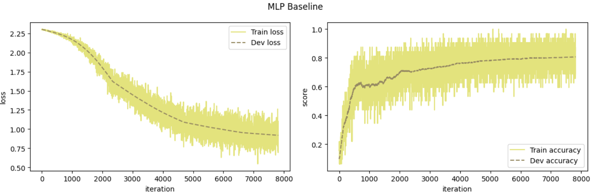
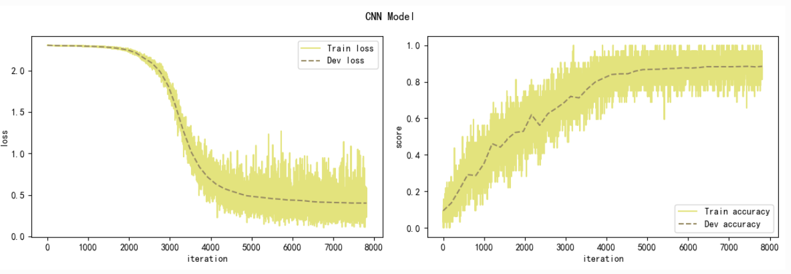
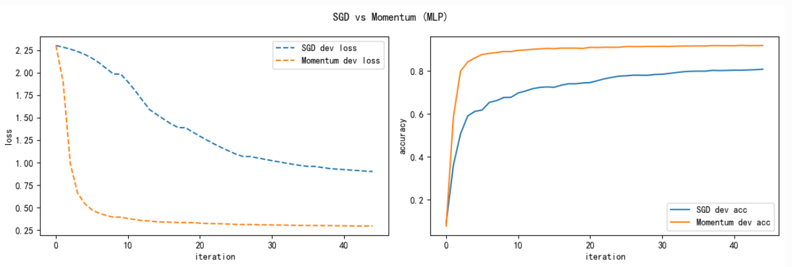
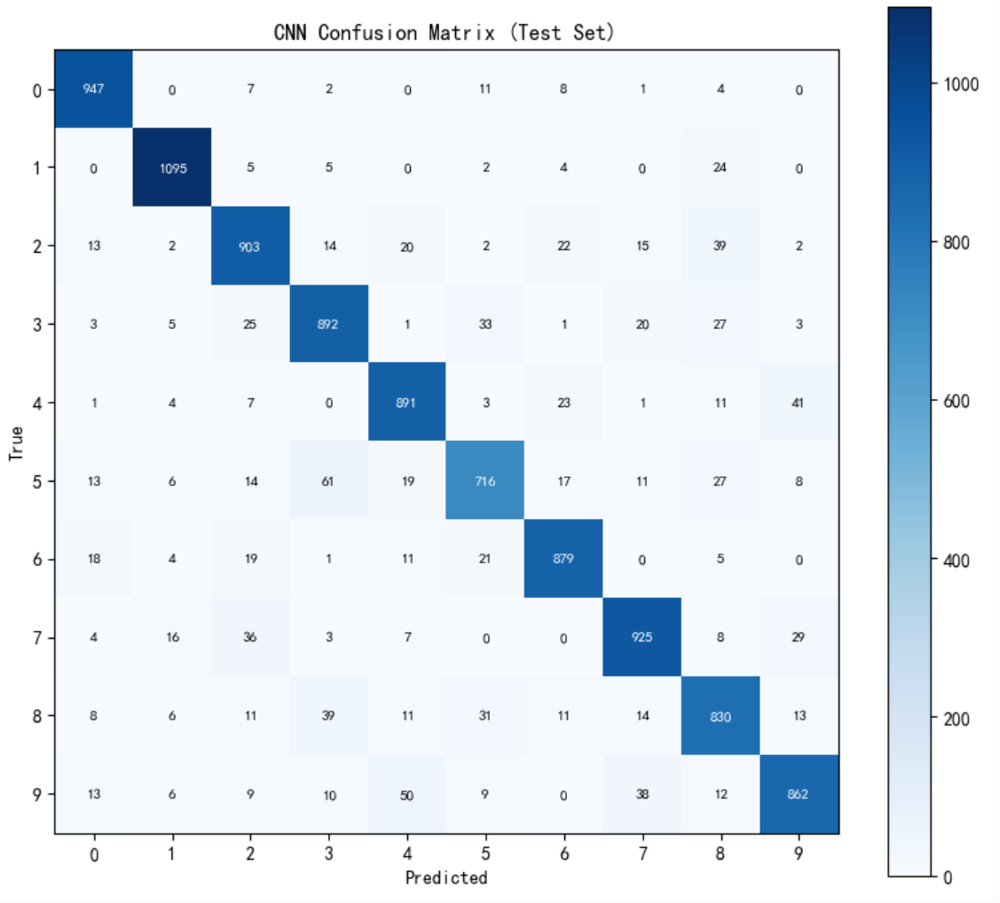
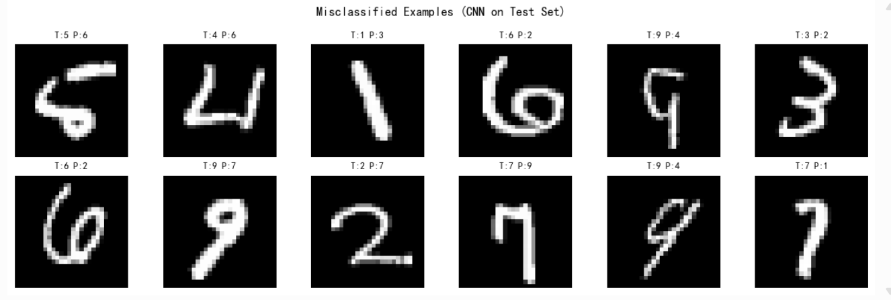
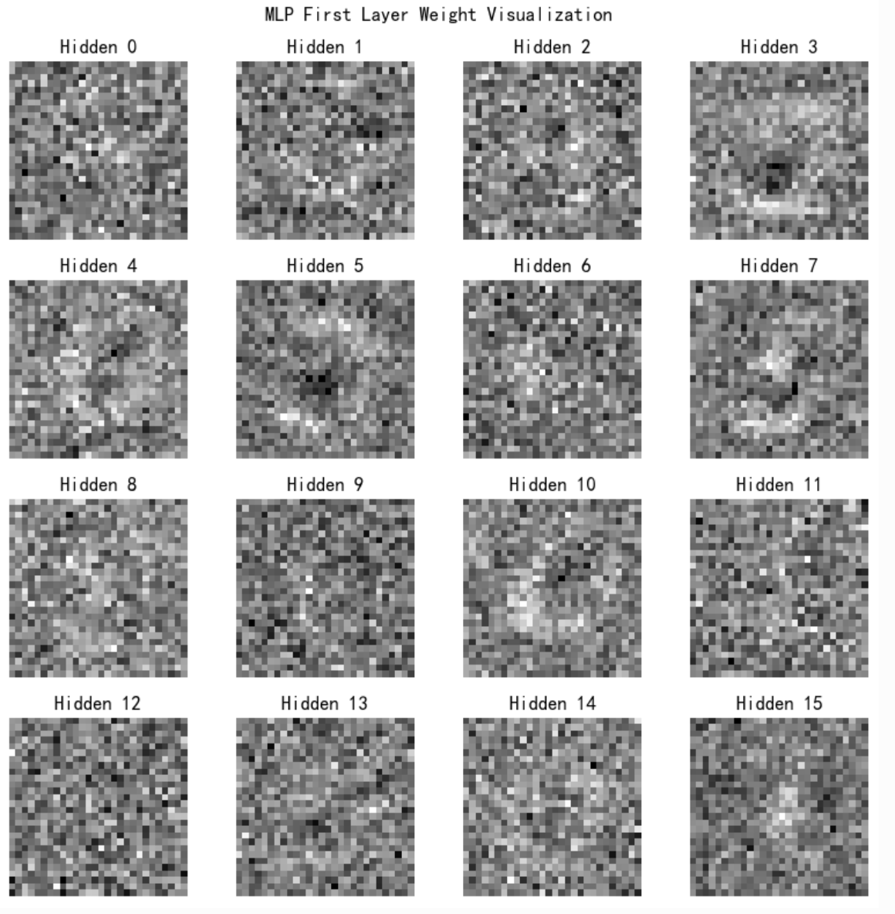

# Project 1 实验报告

**姓名**: 顾晓菡  
**学号**: 22300680289  
**课程**: Neural Network and Deep Learning  
**日期**: 2026年5月

**代码仓库**: https://github.com/HuUhuHU/-Neural-Network-Project-1
**模型权重**: _（请填写 ModelScope 链接）_

---

## 1. MLP baseline (Part A)

### 1.1 模型结构

采用两层全连接 MLP：

| 层 | 输入维度 | 输出维度 | 激活 |
|----|---------|---------|------|
| Linear | 784 | 600 | ReLU |
| Linear | 600 | 10 | — |

- 输入：MNIST 28×28 灰度图展平为 784 维向量
- 损失函数：Softmax + 交叉熵（`MultiCrossEntropyLoss`）
- 优化器：SGD，初始学习率 0.06
- 学习率调度：MultiStepLR，在 30%/60%/85% 迭代处衰减为 0.5 倍
- 正则化：L2 权重衰减 λ=1e-4
- Batch size：32，训练 5 个 epoch

### 1.2 实现要点

在 `mynn/op.py` 中实现：

- Linear.forward: \( Y = XW + b \)
- Linear.backward: 计算 \(\frac{\partial L}{\partial W}\)、\(\frac{\partial L}{\partial b}\) 并反向传播至输入
- MultiCrossEntropyLoss: 数值稳定的Softmax + 交叉熵，反向传播梯度 \((p - y) / N\)

### 1.3 训练结果

| 指标 | 数值 |
|------|------|
| 最佳验证集准确率 | 0.8060 |
| 测试集准确率 | 0.8170 |

**学习曲线**：训练损失逐步下降，验证准确率稳步上升，表明模型收敛正常。

---

## 2. Part B: CNN Model CNN model and MLP-vs-CNN comparison

### 2.1 CNN 结构

| 层 | 参数 | 输出尺寸 |
|----|------|---------|
| Conv2D | 1→8 通道, 3×3, pad=1 | 28×28 |
| ReLU | — | 28×28 |
| Conv2D | 8→16 通道, 3×3, stride=2, pad=1 | 14×14 |
| ReLU | — | 14×14 |
| Conv2D | 16→32 通道, 3×3, stride=2, pad=1 | 7×7 |
| ReLU | — | 7×7 |
| Flatten | — | 1568 |
| Linear | 1568→128 | — |
| ReLU | — | — |
| Linear | 128→10 | — |

`conv2D` 使用im2col方法手写实现，包含forward和backward传播。

### 2.2 参数设置

MLP与CNN使用相同的训练配置：

- 学习率 0.06，batch size 32，5 epoch
- 相同的 MultiStepLR 调度策略
- 相同的训练/验证集划分（seed=309，10000 验证样本）

### 2.3 训练流程实现说明

这部分在starter code的`runner.py`基础上做了调整：原始训练循环会在每个 mini-batch 更新后都对完整验证集进行一次评估。对于NumPy CNN，完整验证集评估需要反复执行大量卷积计算，会使训练速度非常慢。
因此，本实验将验证集评估改为每个 mini-batch 仍然正常执行 forward、loss、backward 和参数更新；每隔 `log_iters` 个 iteration 评估一次完整验证集并记录 learning curve；每个 epoch 结束后额外评估一次完整验证集，并根据验证准确率保存 best model；验证集评估内部按 batch 分块计算，最终 loss 和 accuracy 按样本数加权平均，结果等价于一次性评估完整验证集。

### 2.4 对比结果

| 模型 | 验证集准确率 | 测试集准确率 |
|------|------------|------------|
| MLP | 0.8060 | 0.8170 |
| CNN | 0.8844 | 0.8940 |

### 2.5 分析：为什么 CNN 更适合图像分类？

1. 卷积核在图像上滑动，每个卷积核检测一种局部特征，参数量远小于全连接层。
2. 同一卷积核在不同位置检测相同模式，对数字位置变化更稳健。
3. 浅层学习边缘、笔画，深层组合为更复杂的数字结构。
4. MLP 将 28×28 图像展平为 784 维向量，破坏了空间邻域关系；CNN 保留了二维空间结构。
CNN在验证集和测试集上均优于MLP，优势比较明显。
---

## 3. Part C: Choose Two Additional Directions

### 3.1 Direction 1: Optimization

在相同 MLP 结构下，将优化器从SGD替换为MomentGD（μ=0.9），其余超参数不变。

Baseline：SGD

| 优化器 | 验证集准确率 | 测试集准确率 |
|--------|------------|------------|
| SGD | 0.8074 | 0.8173 |
| Momentum (μ=0.9) | 0.9177 | 0.9239 |

结论：Momentum通过累积历史梯度方向，在损失曲面平坦区域加速收敛，在振荡方向起平滑作用，在相同epoch内达到更高准确率。

### 3.2 方向 5：误差分析与可视化

对最佳 CNN 模型在测试集上进行：

1. 混淆矩阵：观察哪些数字对之间最易混淆
2. 错分样本可视化：展示预测错误的图像
3. 卷积核可视化：第一层 8 个 3×3 卷积核
最易混淆的数字对：5->2

---

## 4. Main results table

| 实验 | 验证集 Acc | 测试集 Acc |
|------|-----------|-----------|
| MLP Baseline | 0.8060 | 0.8170  |
| CNN | 0.8844 | 0.8940 |
| MLP + SGD | 0.8074 | 0.8173 |
| MLP + Momentum | 0.9177 | 0.9239 |

---

## 5. Detailed visualization

1. MLP 训练损失与准确率学习曲线

2. CNN 训练损失与准确率学习曲线

1. SGD vs Momentum 对比曲线

1. CNN 测试集混淆矩阵

1. 错分样本展示

1. 第一层卷积核可视化

1. MLP 权重可视化

---

## Discussion

### Why is CNN more suitable than MLP for image classification?

CNN更适合图像分类，主要是因为它能够保留图像的二维空间结构。MNIST图像中的相邻像素通常会组成有意义的局部模式，例如笔画、边缘和拐角。MLP会先把28×28的图像展平成784维向量，这会削弱像素之间的空间邻接关系，而CNN直接在二维图像上使用卷积核提取局部特征，因此更适合处理图像数据。CNN有参数共享的特点。同一个卷积核会在图像的不同位置滑动，因此模型可以在不同位置检测相似的局部模式。这使得CNN对数字位置的小幅变化更加敏感。MLP的每个输入位置都有独立参数，对空间结构的利用不如CNN充分。

### Does the CNN improve validation or test accuracy?

根据实验结果，CNN相比MLP baseline在验证集和测试集上都有提升。这说明卷积层能够更好地捕捉手写数字中的局部结构特征，从而提高模型的泛化能力。虽然MLP和CNN使用了相同的数据划分、相同的训练轮数和类似的优化设置，但CNN由于具有更适合图像任务的结构先验，因此能够获得更好的分类效果。

### Which two additional directions did you choose, and why?

选择Optimization和error analysis/visualization。
在Optimization方面，比较了普通SGD和带动量的Momentum。Momentum是SGD的常见改进方法，它可以累积历史梯度方向，使优化过程更加平滑，并可能加快收敛速度。通过这个实验，可以观察一个简单的优化器改动是否会影响训练速度和最终准确率。
在error analysis/visualization方面，我绘制了混淆矩阵、错分样本、MLP第一层权重以及CNN第一层卷积核。选择这个方向是因为准确率只能说明模型整体表现，而不能说明模型具体在哪些类别上容易出错，也不能展示模型学到了什么样的特征。通过可视化可以更直观地理解模型行为。

### Which modification or analysis is the most informative?

我认为是混淆矩阵和错分样本分析。混淆矩阵可以清楚地显示模型最容易混淆哪些数字类别，例如形状相近的数字对。错分样本进一步展示了错误产生的原因，例如书写潦草、笔画断裂、数字位置偏移，或者某些数字本身形状接近其他类别。卷积核可视化也有一定价值，因为它展示了 CNN 第一层学习到的局部特征。

### What kinds of samples are still hard for your model?

模型仍然容易在书写不清楚或形状相似的数字上出错。例如5和2这类数字在某些手写风格下非常相似，容易被模型混淆。
此外，笔画过细、笔画断裂、数字位置明显偏移、轻微旋转或书写风格不规则的样本也更难分类。这说明CNN虽然比MLP更适合图像分类，但对于复杂的手写变化仍然不是完全正确。后续可以通过数据增强、正则化或更深的CNN结构进一步提高模型的稳定性。

